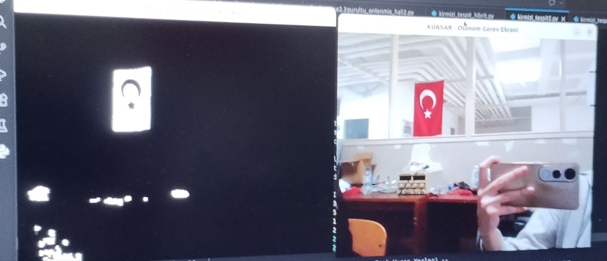

# OpenCV-Renk-Tabanli-Hedef-Takip (Hybrid Red Object Detection)

Bu proje, Python ve OpenCV kütüphanesi kullanılarak gerçek zamanlı kırmızı renk tespiti ve takibi yapmak amacıyla geliştirilmiştir. Özellikle dış ortamdaki ışık değişimlerinden ve kahverengi gibi kırmızıyı taklit eden gürültülerden kurtulmak için **HSV** ve **LAB** renk uzaylarını birleştiren hibrit bir filtreleme yaklaşımı sunar.

## Ekran Görüntüleri


## Teknik Yaklaşım

Standart renk tespiti yöntemleri, değişken ışık koşullarında genellikle yetersiz kalmaktadır. Bu projede kullanılan algoritma şu aşamalardan oluşur:

* **HSV Çift Maskeleme:** Hem koyu hem de parlak kırmızı tonlarını yakalamak için iki farklı spektrum taranır ve birleştirilir.
* **LAB Renk Uzayı Filtresi:** Kırmızıyı kahverengi tonlarından net bir şekilde ayırmak için LAB renk uzayındaki **A kanalı** (yeşil-kırmızı dengesi) üzerinde özel bir eşikleme yapılır.
* **Morfolojik İşlemler:** Görüntüdeki küçük pürüzler ve gürültüler `Opening` ve `Closing` işlemleriyle temizlenir.
* **Geometrik Doğrulama:** Tespit edilen nesnelerin alan büyüklüğü (>600 piksel) ve en-boy oranı (kareye yakınlık) kontrol edilerek sadece hedef nesneler (örneğin kutu veya belirli işaretçiler) işaretlenir.

## Özellikler

* **Gürültü Engelleme:** LAB filtresi sayesinde kahverengi nesneler kırmızı olarak algılanmaz.
* **Gerçek Zamanlı Performans:** PC kamerası üzerinden düşük gecikmeli tespit.
* **Görsel Takip:** Tespit edilen hedeflerin etrafına otomatik sınırlayıcı kutu (Bounding Box) çizimi.

## Kullanım Alanları
Bu algoritma, özellikle şu alanlarda temel bir modül olarak kullanılabilir:
* **Otonom İHA Sistemleri:** İniş pedleri veya havadan hedef tespiti/takibi.
* **Robotik Navigasyon:** Belirli renkli işaretçileri takip eden kara araçları.
* **Endüstriyel Otomasyon:** Üretim hattında renk tabanlı nesne sayımı veya ayıklama.

## Kurulum

Öncelikle sisteminizde Python'un kurulu olduğundan emin olun. Ardından gerekli kütüphaneleri yüklemek için terminalde şu komutu çalıştırın:

```bash
pip install -r requirements.txt
```
## Kullanım

Projeyi çalıştırmak için ana dizinde şu komutu yürütün:

```bash
python kirmizi_tespit_son.py
```
* Program başladığında 'Tespit' ve 'Maske' adında iki pencere açılacaktır.
* Çıkış yapmak için klavyeden 'q' tuşuna basmanız yeterlidir.

## Geliştirici
* **Feyza Nur Dandal**

